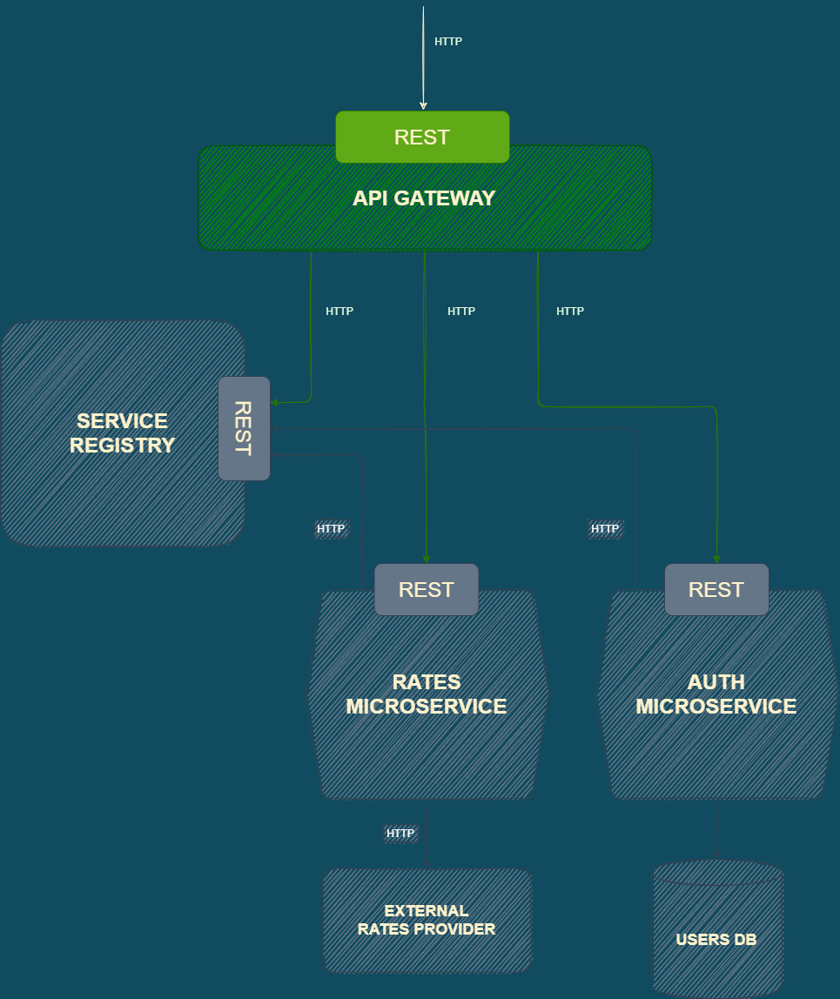

# API Gateway

## Description

- Implemented as a part of [API Gateway / Backends for Frontends Pattern](https://microservices.io/patterns/apigateway.html).
- API Gateway receives requests from the outside, asks Service Registry for a certain microservice's location, sends the original request to the microservice.
- API Gateway is responsible for validating the content of the post requests.
- API Gateway is responsible for checking if a request contains a valid JWT token for protected endpoints.

## Location in the app's architecture

## Structure

| File/Folder  | Description                                          |
| :----------- | :--------------------------------------------------- |
| app.js       | Microservice's app                                   |
| bin          | Server set up and listening                          |
| config       | Config files                                         |
| controllers  | Endpoints' handlers                                  |
| exceptions   | Class to generate custom API errors                  |
| helpers      | Project's constants                                  |
| middleware   | Middleware for verification and authentication check |
| routes       | Endpoints                                            |
| services     | Classes to work with app's services                  |
| .example.env | Info about expected environment variables            |
