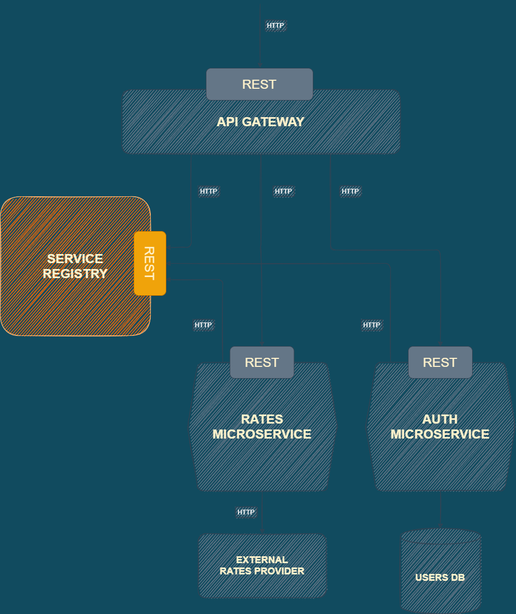

# Service Registry

## Description

- Implemented as a part of [Server-side Service Discovery Pattern](https://microservices.io/patterns/server-side-discovery.html).
- Receives requests from newly launched microservices and stores their data.
- Receives requests from API Gateway to locate a microservice and replies back with microservice's IP and port.
- The registry keeps the records about microservices for 30 seconds. Then updates the info (if the request is received from a microservice in question) or removes the record (if there is no request from the microservice's instance).

## Location in the app's architecture

## Structure

| File/Folder  | Description                               |
| :----------- | :---------------------------------------- |
| app.js       | Registry's app                            |
| bin          | Server set up and listening               |
| controllers  | Endpoints' handlers                       |
| helpers      | Project's constants                       |
| routes       | Endpoints                                 |
| service      | Classes to work with app's services       |
| .example.env | Info about expected environment variables |
