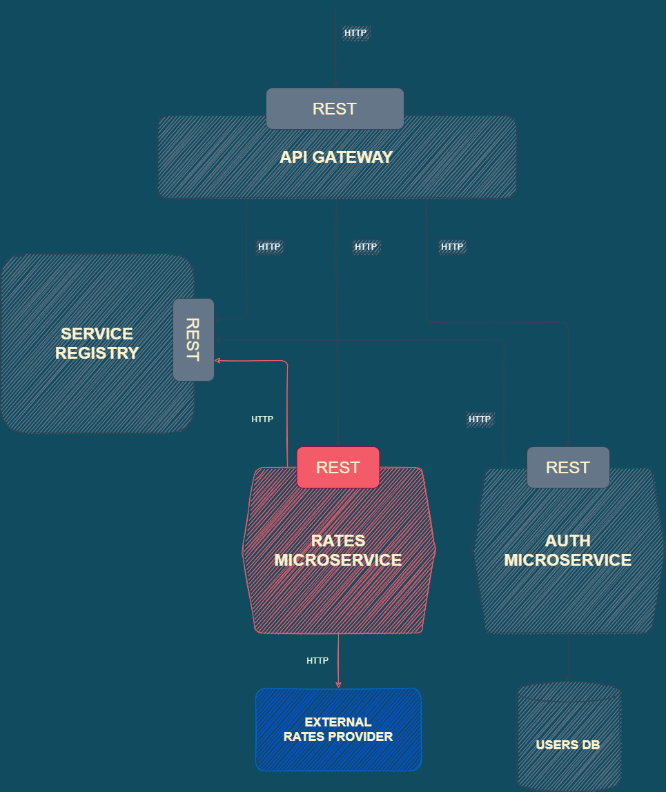

# RATES Microservice

## Description

- The ports are assigned dynamically.
- Once the microservice is up, it sends an HTTP request to Service Registry to register itself with current IP and port.
- The microservice receives requests from API Gateway, fetches rates info from en external API and replies back.

## Location in the app's architecture

## Structure

| File/Folder  | Description                                                           |
| :----------- | :-------------------------------------------------------------------- |
| app.js       | Microservice's app                                                    |
| bin          | Server set up and listening                                           |
| controllers  | Endpoints' handlers                                                   |
| exceptions   | Class to generate custom API errors                                   |
| helpers      | Project's constants                                                   |
| http         | Configured axios client                                               |
| provider     | Configured rates provider                                             |
| registration | Script for the microservice to register itself with Service Registery |
| routes       | Endpoints                                                             |
| service      | Classes to work with app's services                                   |
| .example.env | Info about expected environment variables                             |
