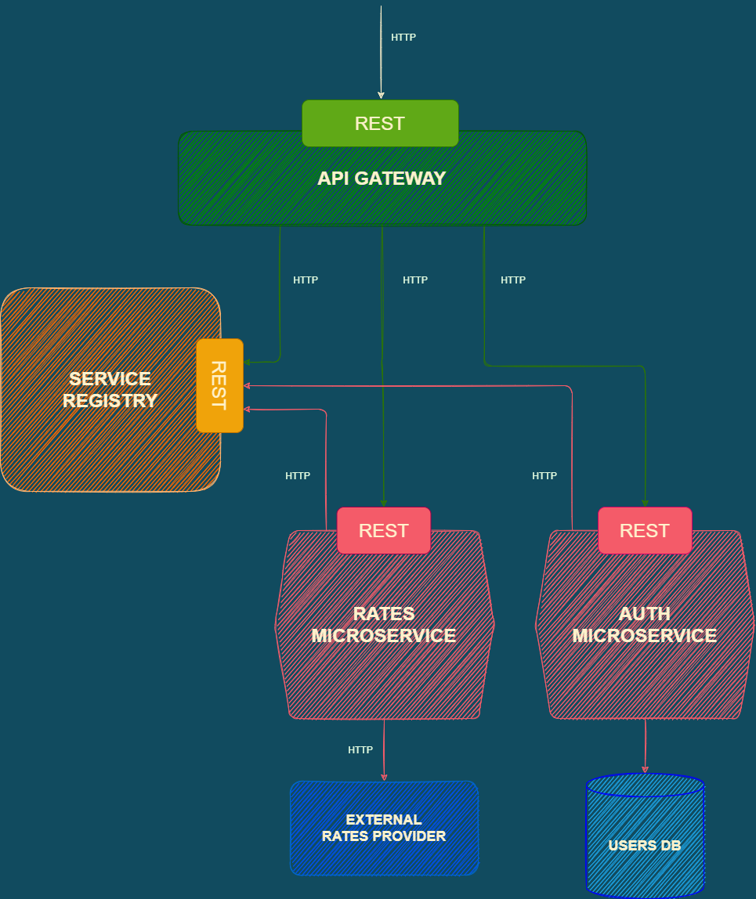

# SE School - HW05 - Microservices

The current project presents a system of:

- [API Gateway](https://github.com/Larisa-Antsifrova/se-school-hw05-microservices/tree/main/01.api-gateway)
- [Service Registry](https://github.com/Larisa-Antsifrova/se-school-hw05-microservices/tree/read-mes/02.service-registry)
- [Auth Microservice](https://github.com/Larisa-Antsifrova/se-school-hw05-microservices/tree/read-mes/03.auth-microservice)
- [Rates Microservice](https://github.com/Larisa-Antsifrova/se-school-hw05-microservices/tree/read-mes/04.rates-microservice)

The homework's goal is:

- to extract a Rates service into its separate microservice

The homework's motto:

- _...Software is made of feelings. (с) A.A._

P.s. For education purposes, separate microservices are stored in one GitHub repository. Details about each component are provided in corresponding Readme files in each subdirectory.

## Note to code reviewer

Hi Andrii!  
&nbsp;
IN PROGRESS...

## Project's architecture overview



## Setting up the app locally

IN PROGRESS...

## Endpoints

Here are the endpoints to explore:

### /auth/signup - Registering a new user

Registers new users.

- Name, email, and password are required.
- The fields are validated with the Joi library.
- If the email is already in use, the error of conflict is returned.
- If validation is successful and the email is unique, the password is hashed and the new user is saved in the database.
- No authentication token is returned in case the verification stage will be added (for example, verification via e-mail).

#### Registration request example

```shell

POST /user/create
Content-Type: application/json
RequestBody: {
  "name": "Software Engineering School",
  "email": "software@engineering.school",
  "password": "ses123456"
}

```

### /auth/login - Logging in a user

Authenticates a user.

- Email and password are required.
- The fields are validated only for their presence.
- If a user with the provided e-mail and/or password does not exist in the database, a general error message is returned.
- If validation is successful and credentials are right, the JSON Web Token is created and returned.
- JWT has a limited life span.

#### Login request example

```shell

POST /user/login
Content-Type: application/json
RequestBody: {
  "email": "software@engineering.school",
  "password": "ses123456"
}

```

### /rates - Getting current BTC to UAH rate information

Provides current rate of BTC to UAH.

- The endpoint is available only for authenticated users.
- isAuthenticated middleware verifies JWT in Authorization header (Bearer token).
- If the provided JWT is valid the endpoint returns the current rate of 1 BTC to UAH.
- [Coinlayer API](https://coinlayer.com/documentation) is used to get the rate.

#### Current BTC to UAH rate request example

```shell

GET /rates

```

## Tools

- JavaScript (Node.js)
- [Express](https://expressjs.com/) - Node.js web application framework.
- [Axios](https://www.npmjs.com/package/axios) - for http requests.
- [bcryptjs](https://www.npmjs.com/package/bcryptjs) - for hashing passwords.
- [jsonwebtoken](https://www.npmjs.com/package/jsonwebtoken) - for generating, signing, verifying JWT.
- [helmet](https://www.npmjs.com/package/helmet) - for securing the Web API.
- [Joi](https://joi.dev/api/) - for validating data provided in POST requests.
- [Postman](https://www.postman.com/) - for endpoints testing.
- [diagrams.net](https://app.diagrams.net/) - for arch diagrams.

## Resources

Rates provider:

- [Coinlayer](https://coinlayer.com/documentation)

Microservices:

- [Pattern: API Gateway / Backends for Frontends](https://microservices.io/patterns/apigateway.html)
- [Pattern: Server-side service discovery](https://microservices.io/patterns/server-side-discovery.html)
- [WDJ Node JS Microservices Tutorial](https://www.youtube.com/playlist?list=PLrwNNiB6YOA0KmfliJoSuZzEN6tjSdEXc)
- [Microservices Meetup - HighLoad Conference](https://www.youtube.com/watch?v=z7AIKbydOJE&ab_channel=HighLoadChannel)
- Monolith to Microservices by Sam Newman (O'Reilly). Copyright 2020 Sam Newman, 978-1-492-07554-7.

Extra:

- [Docker](https://docs.docker.com/)
- [Docker Compose](https://docs.docker.com/compose/gettingstarted/)
